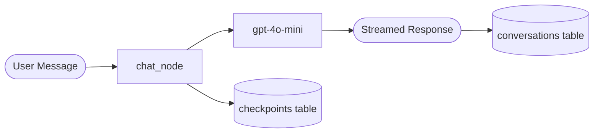
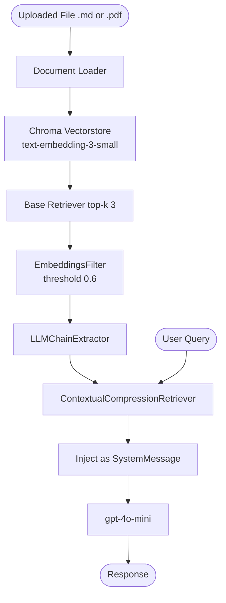
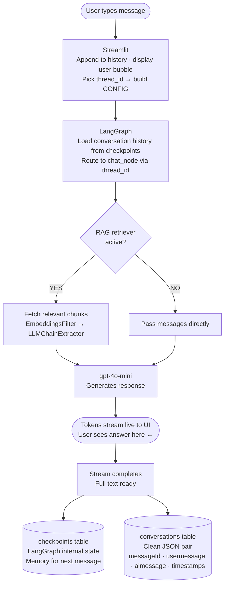

# SIM Support Chatbot — (PRD) Product Requirements Document

**Version:** 1.0  
**Status:** In Development  
**Python Version:** Python 3.13.13

---

## Tech Stack

| Layer | Tool | Why |
|---|---|---|
| **LLM** | `gpt-4o-mini` (OpenAI) | Fast, cost-effective, good reasoning |
| **Embeddings** | `text-embedding-3-small` (OpenAI) | Compact, accurate semantic search |
| **Orchestration** | LangGraph (`StateGraph`) | Manages conversation flow as a graph |
| **Memory / Checkpointing** | LangGraph `SqliteSaver` | Persists chat state across sessions |
| **Vector Store** | Chroma | Stores and searches document embeddings |
| **RAG Pipeline** | LangChain `DocumentCompressorPipeline` | Best retrieval quality from our testing |
| **Conversation Storage** | SQLite (`conversations` table) | Clean JSON storage of message pairs |
| **Frontend** | Streamlit | Quick, clean chat UI |
| **Config** | `python-dotenv` | Manages API keys via `.env` |

---

## Pipelines

### 1. General Chat Pipeline
Plain conversational flow — no document involved.



### 2. RAG Pipeline
Kicks in when the user uploads a `.md` or `.pdf` file from the sidebar.



---

## Data Flow — End to End

The diagram below shows the full journey of a message through the system, from the moment the user hits enter to the moment it's saved in the database.



---

## Walkthrough — "How to Create Invoice?"

Here's the exact journey of a real message through the system, step by step.

**1. Streamlit captures the input**

User types `"How to Create Invoice?"`. Streamlit appends it to `message_history`, displays it in the chat UI, and packages the active `thread_id` (e.g. `9e7b7450-ebee-4b78...`) into `CONFIG`.

**2. LangGraph loads memory and routes**

`chatbot.stream()` is called with the user message and `CONFIG`. LangGraph looks up `thread_id` in the `checkpoints` table, loads the full conversation history, and passes everything into `chat_node`.

**3. chat_node decides: RAG or direct?**

- **File uploaded →** retrieves relevant chunks from Chroma, injects them as a `SystemMessage` with context, then calls `gpt-4o-mini`
- **No file →** calls `gpt-4o-mini` directly with message history

**4. Response streams live to the UI**

`st.write_stream()` displays tokens word-by-word as they arrive. The user sees the answer building in real time — before anything is saved.

**5. After stream completes — two saves happen**

```
Save 1 → checkpoints table (LangGraph internal)
         thread_id: 9e7b7450-ebee-4b78...
         state: [HumanMessage("How to Create Invoice?"), AIMessage("To create an invoice...")]
         → gives the bot memory for the next message

Save 2 → conversations table (our clean record)
         {
           "messageId":    "msg_3f2a1c9b",
           "usermessage":  "How to Create Invoice?",
           "aimessage":    "To create an invoice, go to the Invoice tab...",
           "type":         "TEXT",
           "createdTime":  1778754039140
         }
```

> **Key order:** Stream to UI first → save to DB after. Display is always the priority.

---

## Database Structure (`chatbot.db`)

Two separate tables live in the same SQLite file:

**`checkpoints` + `writes`** — managed entirely by LangGraph. Don't touch these. They store serialized graph state and enable per-thread memory.

**`conversations`** — our custom table. Human-readable, clean JSON.

```json
{
  "_id": "550e8400-e29b-41d4-a716-446655440000",
  "createdTime": 1778753765557,
  "updatedTime": 1778754115185,
  "messages": [
    {
      "messageId": "msg_3f2a1c9b",
      "usermessage": "What is the price of the basic plan?",
      "aimessage": "The basic plan costs 200rs per month.",
      "type": "TEXT",
      "createdTime": 1778754039140
    },
    {
      "messageId": "msg_4a1b2c3d",
      "usermessage": "Does it include tax?",
      "aimessage": "Yes, all applicable taxes are included.",
      "type": "TEXT",
      "createdTime": 1778754115110
    }
  ]
}
```

---

## Current Capabilities

- ✅ Multi-turn memory per conversation thread (survives app restarts)
- ✅ Multiple chat threads, switchable from the sidebar
- ✅ RAG over uploaded `.md` and `.pdf` files
- ✅ Streamed responses (real-time token-by-token output)
- ✅ Clean conversation storage in SQLite (JSON format)
- ✅ Remove uploaded document and switch back to general chat anytime

---

## Known Gaps / Next Steps

- 🔲 RAG answer quality needs tuning (retrieval accuracy, chunk size)
- 🔲 Persistent Chroma with delete-on-re-upload (avoid stale embeddings)
- 🔲 System prompt customization (define bot persona / domain scope)
- 🔲 UI thread labels (show first message as thread title instead of UUID)
- 🔲 Auth layer (user login, per-user conversation isolation)
